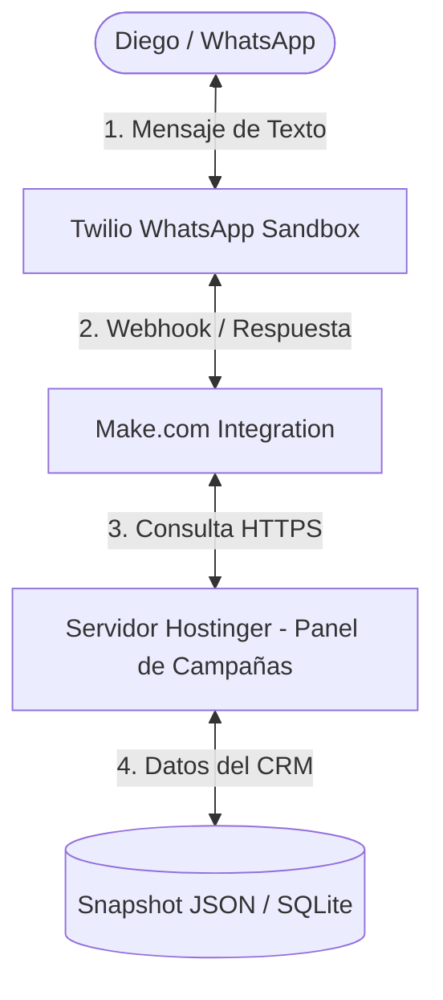

# Proyecto Daniela 🤖💬

Este proyecto contiene la documentación, scripts de automatización e integraciones locales de **Daniela**, la asistente virtual inteligente por WhatsApp diseñada para Diego.

## Arquitectura del Proyecto

Daniela conecta diferentes sistemas para funcionar al 100% de manera automatizada y a bajo costo:

## Componentes

1. **Backend (Servidor Hostinger):** 
   - Endpoint: `https://panel.ambrizydavalos.com/api/daniela/resumen`
   - Función: Extrae los datos más recientes de pólizas consolidadas y campañas de la base de datos y genera una respuesta limpia formateada con emojis.
2. **Integración (Make.com):**
   - Recibe la petición de Twilio, llama al endpoint de la API del panel de campañas, y regresa la respuesta a Twilio.
3. **Plataforma de Mensajería (Twilio):**
   - Provee el número de WhatsApp Sandbox para interactuar gratis.

## Historial de Pasos y Configuración

- **[Pendiente]** Compilación y despliegue del endpoint de Daniela en el servidor de producción.
- **[Pendiente]** Creación de cuentas en Twilio y Make.com.
- **[Pendiente]** Configuración del escenario de integración de Make.com.
